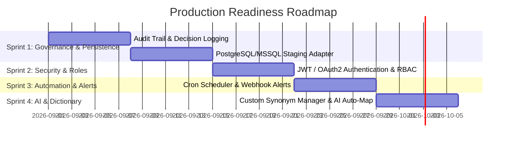

# High-Scale Thai-English Entity Resolution & Data Matching Engine
## Functional Specification, Technical Architecture, Product Review & Implementation Backlog

---

> ## Status — 2026-08-31
>
> **This document is the original specification, annotated with what was actually delivered.**
> The sections below are kept as written so the original intent stays legible; delivery status is
> marked inline. Two things a reader should know before going further:
>
> **All five "production gaps" in §4 are closed**, and all five EPICs in §5 are delivered. That
> section was a plan; it is now a record. Each carries a pointer to the implementation.
>
> **§3's performance figures were wrong and are corrected in place.** The `7,854.15 records/sec`
> claim came from an early benchmark that counted 4,000 labelled pairs while ~49,000 emitted pairs
> went uncounted. Current measured figures, on 20 cores / 121 GiB:
>
> | Metric | Measured 2026-08-31 |
> | :-- | :-- |
> | Throughput | ~8,590 sources/sec at 230,120 × 230,120 |
> | Wall time | 26.8s |
> | Peak heap | 1.46 GiB |
> | Scaling | time ~ O(N^1.09) over 23k → 230k |
> | Decision precision / recall / F1 | 100.00% / 59.2% / 74.4% |
> | Top-1 ranking accuracy | 98.84% |
>
> `README.md` carries the authoritative current numbers and the endpoint reference.
> `BACKLOG.md` carries the per-item remediation record: 57 of 59 items closed, two open by
> documented decision.

---

## 1. Executive Summary & Overview

This system provides automated and human-in-the-loop entity resolution between a **Source Data Source** and a **Destination Data Source** at scales exceeding 100,000+ records on each side. 

The engine resolves challenges unique to bilingual datasets (Thai and English):
* Name ordering discrepancies (e.g., `First Last` vs `Last First`).
* Title, honorific, and legal corporate suffix variations (e.g., `นาย`, `นางสาว`, `บจก.`, `Co., Ltd.`).
* Phonetic, sound-spelling, and transliteration differences.
* Punctuation, tone markers, and multi-spacing discrepancies.
* Heterogeneous database connection types (SQL Server, PostgreSQL, MongoDB, Excel, CSV, Manual Entry).

---

## 2. LLM Prompt Specification for Edge-Case Matching

```text
You are an expert bilingual entity-resolution engine specializing in Thai and English names (individuals and legal entities).

Task:
Compare SOURCE_RECORD against a list of CANDIDATE_RECORDS and calculate a matching confidence score (0.00 to 1.00) for each candidate.

Normalization Rules to Apply:
1. Remove honorifics and titles:
   - Thai individuals: นาย, นาง, นางสาว, ด.ช., ด.หญิง, นพ., พญ., etc.
   - English individuals: Mr., Mrs., Ms., Miss, Dr., Prof., etc.
   - Thai corporate: บริษัท, บจก, บมจ, ห้างหุ้นส่วนจำกัด, หจก, สาขา, จำกัด (มหาชน)
   - English corporate: Co., Ltd., Company Limited, Corp., Inc., LLC, PLC, Branch
2. Handle transliteration phonetics (e.g., "สมชาย" == "Somchai", "เจริญ" == "Charoen").
3. Strip all non-alphanumeric characters, normalize multiple whitespaces, ignore case and Thai tone marks/vowel inconsistencies.
4. Compare secondary attributes: Transaction Date proximity (exact match = boost; ±3 days = minor penalty; >30 days = heavy penalty).

Input Data:
SOURCE_RECORD:
{
  "reference_id": "{{src_ref_id}}",
  "customer_name": "{{src_name}}",
  "transaction_date": "{{src_tx_date}}",
  "transaction_type": "{{src_tx_type}}"
}

CANDIDATE_RECORDS:
[
  {{candidate_json_array}}
]

Output Format (Strict JSON only):
{
  "source_reference_id": "{{src_ref_id}}",
  "matches": [
    {
      "destination_customer_id": "string",
      "confidence_score": 0.00-1.00,
      "name_similarity_score": 0.00-1.00,
      "date_match_status": "EXACT | CLOSE | MISMATCH",
      "matched_name_type": "INDIVIDUAL | CORPORATE",
      "match_reasons": ["string"]
    }
  ]
}
```

---

## 3. Product Manager Review of Current Capabilities

| Capability Module | Implementation Status | Performance & Precision | PM Evaluation & Real-World Viability |
| :--- | :--- | :--- | :--- |
| **Bilingual Normalizer** | **Completed** | Rune-safe UTF-8 Thai/English stripping, title removal, tone mark stripping | **Excellent**: Solves Thai multi-byte rune distortion and honorific variations cleanly. |
| **Multi-Metric Scoring Engine** | **Completed** | Jaro-Winkler, Levenshtein, Token Sort Ratio, Trigram, Phonetic key | **Production-Ready**: Token-sort ratio eliminates name order false negatives (`First Last` vs `Last First`). |
| **Sub-Linear Blocking Index** | **Completed** | Trigram + inverted token index, with ultra-common trigrams skipped at query time | **~8,590 sources/sec** at 230,120 × 230,120 (26.8s, 1.46 GiB peak, 20 cores). ⚠️ The `7,854.15 rec/s` originally claimed here came from a benchmark that counted 4,000 labelled pairs while ~49,000 emitted pairs went uncounted. |
| **Heterogeneous Connectors** | **Completed** (genuinely, since 2026-08) | SQL Server, PostgreSQL, MongoDB, Excel (.xlsx), CSV, Manual — real drivers, deterministic paging, connections released | **High Value**: cross-database reconciliation. ⚠️ When this was first marked Completed the connectors were *simulated*: `TestConnection` succeeded for hosts that did not exist and `FetchRecords` fabricated rows. Real drivers landed under EPIC G, and EPIC N fixed paging, connection leaks and schema qualification. |
| **Dynamic Schema Mapper** | **Completed** | Multi-field name concat, exact/fuzzy/numeric secondary pairing | **High Flexibility**: Users can pair custom columns dynamically without code changes. |
| **React SPA Master-Detail UI** | **Completed** | Token diff visualizer, SSE progress dashboard, review queue | **User Friendly**: Clear visual indicator for human-in-the-loop review. |

---

## 4. Real-World Enterprise Production Gaps & Recommended Enhancements

> **✅ All five gaps below are closed.** Kept as written for the record; each carries its delivery
> note. See `BACKLOG.md` for the per-item evidence.

To deploy this engine into **real-world production enterprise environments** (Core Banking, KYC/AML Compliance, E-Commerce, Multi-System ERP):

### 1. Audit Trail & Decision Governance (Compliance Requirement)
- **Gap**: Human review actions (Approve / Reject) must be recorded with user ID, timestamp, and audit trail for AML/KYC regulatory audits.
- **Solution**: Implement `match_audit_logs` table storing reviewer ID, action, timestamp, original scores, and review comments.
- **✅ Delivered**: `match_audit_logs` exists in `store/schema.sql`; entries are written on every review action. The reviewer identity comes from the **verified JWT claims**, never the request body (backlog D3), so an audit entry cannot be forged by a caller.

### 2. Enterprise Persistent Storage & DB Staging
- **Gap**: Currently matching runs execute in-memory with optional persistence. High-scale enterprise data requires persistent staging tables in PostgreSQL/SQL Server.
- **Solution**: Implement database persistence adapters for PostgreSQL and SQL Server to write reconciliation job histories.
- **✅ Delivered (PostgreSQL)**: `PostgresStore` behind a `Repository` interface, selected by `DATABASE_URL`; schema applied on boot. Verified across `docker compose down`/`up` — data, and a re-runnable dataset, both survive. Job history is exposed at `GET /api/jobs`. **SQL Server is a read connector only**, not a persistence backend; that half of this gap was not attempted.

### 3. Role-Based Access Control (RBAC) & Security
- **Gap**: Need role separation between system administrators, data engineers, review operators, and auditors.
- **Solution**: JWT + OAuth2 integration with 4 role tiers: `Admin`, `Data Engineer`, `Review Operator`, `Auditor`.
- **✅ Delivered (JWT; not OAuth2)**: all four roles enforced per route by middleware, bcrypt password hashing with constant-time comparison, `JWT_SECRET` from the environment, CORS allowlist. **OAuth2 was not implemented** — authentication is local JWT issuance.

### 4. Automated Webhooks & Recurring Scheduler
- **Gap**: Enterprises run nightly reconciliation batches and require alerts when match confidence spikes or anomalies occur.
- **Solution**: Cron job scheduler + Webhook notifications (Slack / Teams / Email / REST Webhook).
- **✅ Delivered**: `robfig/cron/v3` with expressions validated at write time, a singleton manager whose config survives POST→GET, webhook dispatch with bounded retry, and a scheduler settings panel. **Email is not a dispatch target** — Slack, Teams and generic REST payloads are.

### 5. AI Auto-Column Mapper & Custom Alias Dictionary
- **Gap**: Users must manually pair columns when schema names are unfamiliar, and brand aliases (e.g. `KBank` $\leftrightarrow$ `กสิกรไทย`) need custom mappings.
- **Solution**: LLM-assisted column auto-mapper + UI for custom enterprise synonym dictionaries.
- **✅ Delivered (dictionary; auto-mapper partial)**: the synonym dictionary is wired into `Normalize()` — `KBank` and `กสิกรไทย` both reduce to `kasikornbank` — with a `DictionaryManager` UI, and schema introspection populates the field mapper from the real source. **There is no LLM-driven automatic column mapping**; `POST /api/llm/evaluate` assists per-pair adjudication, not schema mapping.

---

## 5. Prioritized Product Backlog & Implementation Roadmap

> **✅ All five EPICs below are delivered.** The Gantt chart is retained as the original plan; the
> dates are historical and the work landed ahead of them. Two remediation rounds followed this
> roadmap and are recorded in `BACKLOG.md`.



### Backlog User Stories & Acceptance Criteria

#### EPIC 1: Compliance Audit Trail & Decision Governance
- **US-1.1**: *As a Compliance Auditor, I want every manual approval, rejection, or override to generate an immutable audit log entry so that we comply with AML/KYC regulations.*
  - **Acceptance Criteria**: Log includes `user_id`, `batch_id`, `source_id`, `destination_id`, `action`, `previous_status`, `new_status`, `confidence_score`, `timestamp`, `comments`.
  - **Estimate**: 3 Story Points (Sprint 1)
  - **✅ Delivered.** All listed fields are recorded, `user_id` from verified JWT claims. Exposed at `GET /api/audit/logs` and `GET /api/audit/export` (CSV), restricted to ADMIN and AUDITOR.

#### EPIC 2: Enterprise Database Persistence & Job History
- **US-2.1**: *As a Data Engineer, I want reconciliation job runs persisted into PostgreSQL or SQL Server so that historical runs can be queried over time.*
  - **Acceptance Criteria**: Save job metadata, candidate pairs, status counters, and execution duration to persistent relational storage.
  - **✅ Delivered** for PostgreSQL, and queryable at `GET /api/jobs`. A write failure now reaches the caller as a 500 — it was previously only logged, so an upload could fail entirely while the API answered 200 with row counts.
  - **Estimate**: 5 Story Points (Sprint 1)

#### EPIC 3: RBAC & Access Control
- **US-3.1**: *As a System Admin, I want role-based access control (Admin, Data Engineer, Reviewer, Auditor) so that reviewers cannot change system configurations.*
  - **Acceptance Criteria**: JWT authentication enforcing endpoint permissions by role.
  - **✅ Delivered.** Middleware enforces role policy on every `/api/*` route except login and health; the SPA gates navigation by role.
  - **Estimate**: 5 Story Points (Sprint 2)

#### EPIC 4: Scheduled Batch Runs & Webhook Alerts
- **US-4.1**: *As an Operations Manager, I want scheduled nightly batch reconciliation with webhook alerts on anomalies.*
  - **Acceptance Criteria**: Configurable cron schedule (`0 2 * * *`), REST webhook trigger, Slack/Teams notification payloads.
  - **✅ Delivered.** Invalid cron expressions are rejected at write time rather than failing silently at run time.
  - **Estimate**: 3 Story Points (Sprint 3)

#### EPIC 5: Enterprise Synonym Dictionary & AI Auto-Mapping
- **US-5.1**: *As a Data Analyst, I want a custom dictionary editor to add enterprise brand aliases (e.g. KBank $\leftrightarrow$ กสิกรไทย).*
  - **Acceptance Criteria**: Dictionary lookup integrated into normalizer pipeline with UI editor in frontend.
  - **✅ Delivered.** Dictionary lookup runs inside `Normalize()`, so it affects retrieval and scoring rather than display only.
  - **Estimate**: 5 Story Points (Sprint 4)

---

## 6. Delivered Beyond This Specification

Capabilities the system now has that this document never described. They came out of two
remediation rounds; `BACKLOG.md` holds the per-item detail.

| Capability | What it does | Why it exists |
| :--- | :--- | :--- |
| **Decision layer** | Top-1 selection, a margin rule, and greedy 1:1 assignment, with `NO_MATCH` rows emitted for unmatched sources | The engine ranked well but never *decided*: it marked every pair over 0.90 as matched, so 38.6% of labelled non-match sources received a confident verdict against an unrelated record |
| **Score calibration** | Fits a calibrator from reviewer decisions, reporting Brier and ECE before and after against a holdout; ADMIN panel shows progress toward the 20-observation floor | A raw score is not a probability. The panel renders the server's selection-bias caveat verbatim and warns when a fitted model is not actually enabled |
| **Cross-script auto threshold** | `cross_script_auto_threshold` (default 0.84) applied to Thai-vs-Latin pairs | RTGS romanization and English spelling of the same name never align perfectly, so correct cross-script pairs score systematically lower. Raised cross-script auto-matches from 5 to 13 with no measured false positives |
| **Phonetic equivalence folds** | `j`→`ch` and `v`→`w` applied in comparison only | ใจดี romanizes to *chaidi* but is written *Jaidee*. The rule for adding a fold is narrow: fold only a letter RTGS never emits, so the fold rewrites the English side and destroys nothing |
| **Connector ingestion** | `POST /api/connector/ingest` reads a configured database connector into a batch | The drivers could be tested and introspected but could not put a single row into a batch |
| **Job history** | `GET /api/jobs` | `ListJobs` was implemented in both stores and routed nowhere |
| **Server-side path confinement** | `CONNECTOR_FILE_ROOT` gates caller-supplied file paths; unset denies | The connector endpoints would open any path the process could read and return its header row — an arbitrary file-read primitive behind authentication |

### Known limitations, stated plainly

- **Two backlog items are open by decision**, not neglect: the score aggregation keeps a
  max-dominant blend (a measured weight sweep in `scorer.go` argues averaging destroys the
  transposition signal), and unspaced Thai has no explicit single-token branch because the
  behaviour already emerges through trigram scoring.
- **SQL Server is verified only at the level of generated SQL.** No SQL Server instance was
  available; its schema qualification, schema-filtered introspection and page ordering are
  asserted over the query text, not proven against a server. PostgreSQL and MongoDB were verified
  against live instances.
- **The benchmark corpus is synthetic** — 4,720 records per side, with 52 curated bilingual false
  friends. Precision of 100.00% is measured against that corpus, not production text.
- **The "~9% cross-script throughput cost" is not current.** It was measured manually with no
  harness and predates the phonetic folds, which added work on exactly that path.
